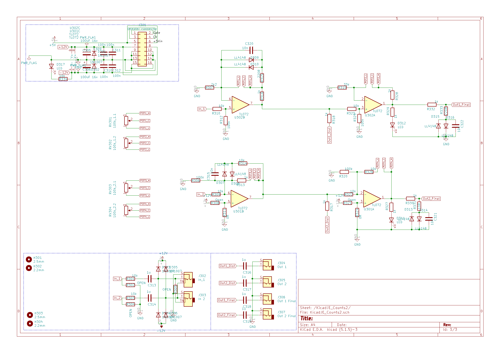

# KicadJE_Counts
Counter module as a successor to EU-3

# Purpose
## Count
10 step counter

Input +/- 10V DC
 - Clock  
 - Hold
 - Reset

Output +/- 10V DC x 10
 - Steps
 - Clock

Adjustment
 - Frequency
 - Hold

## Dist Two
Input +/- 10V DC
 - signal

Output +/- 10V DC
 - signal

Adjustment:
 - Distortion/gain section 1 (ch 1+2) feedback dist
 - Distortion/gain section 2 (ch 1+2) output stage dist + pos LED to GND

# Status - in the mail
## Initial 
| Stage  | Detail | Status |
| ------------- | ------------- | ------------- |
| create material  | sch | ok |
| | pcb | ok |
| | gerber | ok |
| production  |   | ok |
|  | produced | ok |
|  | delivered | in the mail |
## Preliminary validation
| Test  | Detail | Status |
| ------------- | ------------- | ------------- |
| Initial Inspection | | OK |
| Initial Technical Test | Counts |  |
| Initial Technical Test | Dist Two | OK - all pots are reversed - LED should be moved to the free spot between input and outputs |
| Initial Product Test | Counts |  |
| Initial Product Test | Dist Two | Distorts - one channel more than the other - one input splits in two - default component values gives a lot or a little distortion |

## Secondary validation
| Test  | Detail | Status |
| ------------- | ------------- |------------- |
| Product Test | Counts | |
| Product Test | Dist Two | |
| Quality | Counts | |
| Quality | Dist Two | |
| Long Term Product Test |  |  |
| Power Draw |  | 

## Errata
### Errata - Dist Two
* all pots are reversed
* default component values gives a lot or a little distortion

## Issues and Notes
### 

# Pictures

# Schematic
## Counts

## Dist Two

# Analysis
## Counts

## Prototype
